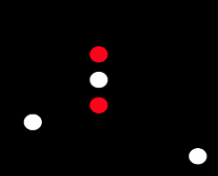

# Rendered list of questions

# sudno_mech_less50_pravo.yml

## Что это?

A) Судно с механическим двигателем, менее 50м, идет налево
B) Судно с механическим двигателем, менее 50м, идет направо
C) Парусное судно, более 50м, идет налево
D) Парусное судно, более 50м, идет направо

* A
* **CORRECT: B**
* C
* D
# sudno_mech_more50_na_nas.yml

## Что это?

A) Судно с механическим двигателем, более 50м, идет на нас
B) Судно с механическим двигателем, менее 50м, идет на нас
C) Парусное судно, более 50м, идет на нас
D) Парусное судно, более 50м, идет направо

* **CORRECT: A**
* B
* C
* D
# cant_maneur_anchor.yml

## Что это?

A) Неуправляемое судно, дрейфует от нас
B) Тральщик менее 50м
C) Судно ограничено в возможности маневрировать, стоит на якоре
D) Рыболовное судно менее 50м, занято буксировкой, длина буксира менее 200м, идет от нас

* A
* B
* **CORRECT: C**
* D
# sudno_50plus_port.yml

## Что это?

A) Судно с механическим двигателем, более 50м, идет налево
B) Судно с механическим двигателем, более 50м, идет направо
C) Судно с механическим двигателем, менее 50м, идет налево
D) Судно с механическим двигателем, менее 50м, идет направо

* **CORRECT: A**
* B
* C
* D
# typi_parusnih_sudov__shlyup.yml
## Тип вооружения с косым гротом и одним стакселем называется..
* Кеч
* Йол
* **CORRECT: Шлюп**
* Тендер
# sudno_50plus_starboard.yml

## Что это?

A) Судно с механическим двигателем, более 50м, идет налево
B) Судно с механическим двигателем, более 50м, идет направо
C) Судно с механическим двигателем, менее 50м, идет налево
D) Судно с механическим двигателем, менее 50м, идет направо

* A
* **CORRECT: B**
* C
* D
# buksir_mech_less50m_port_one_less200m.yml

## Что это?

A) Судно менее 50 метров, занято буксировкой, длина буксира более 200м, идет налево
B) Судно с механическим двигателем, более 50м, идет налево
C) Судно более 50 метров, занято буксировкой, длина буксира менее 200м, идет налево
D) Судно менее 50 метров, занято буксировкой, длина буксира менее 200м, идет налево

* A
* B
* C
* **CORRECT: D**
# hoverboard_less50_port.yml

## Что это?

A) Механическое судно, более 100м, идет налево
B) Рыбак, менее 50м, идет налево
C) Тральщик, менее 50м, идет налево
D) Судно на воздушной подушке, менее 50м, идет налево

* A
* B
* C
* **CORRECT: D**
# sudno_astern.yml

## Что это?

A) Судно с механическим двигателем, более 50м, идет на нас
B) Парусное или механическое судно, идет от нас
C) Парусное судно, более 50м, идет на нас
D) Парусное судно, более 50м, идет направо

* A
* **CORRECT: B**
* C
* D
# sudno_mech_less50m_na_nas.yml

## Что это?

A) Судно с механическим двигателем, более 50м, идет на нас
B) Судно с механическим двигателем, менее 50м, идет на нас
C) Парусное судно, более 50м, идет на нас
D) Парусное судно, более 50м, идет направо

* A
* **CORRECT: B**
* C
* D
# sudno_mech_less50_levo.yml

## Что это?

A) Судно с механическим двигателем, менее 50м, идет налево
B) Судно с механическим двигателем, менее 50м, идет направо
C) Парусное судно, более 50м, идет налево
D) Парусное судно, более 50м, идет направо

* **CORRECT: A**
* B
* C
* D
